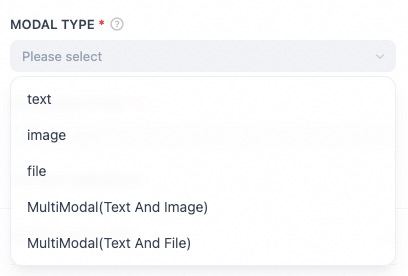

# AI Guardrails Tool

## Overview

AI Guardrails is a security protection product designed by Alibaba Cloud for artificial intelligence systems. It helps AI systems provide safe, compliant, and reliable services when responding to user instructions through high availability and high-precision risk detection solutions.

## Configuration

### 1. Apply for Aliyun Account

Get Aliyun AccessKey ID and Secret from [Aliyun](https://www.aliyun.com/), for more getting tutorial:

- **Create AccessKey**: 
https://help.aliyun.com/zh/ram/user-guide/create-an-accesskey-pair

### 2. Authorize the plugin using Aliyun AccessKey ID and Secret.

### 3. Use the plugin in the workflow application.

1. Select the modal type

2. Select the detect type

3. Based on the selected config text content, image URL, and file URL.

